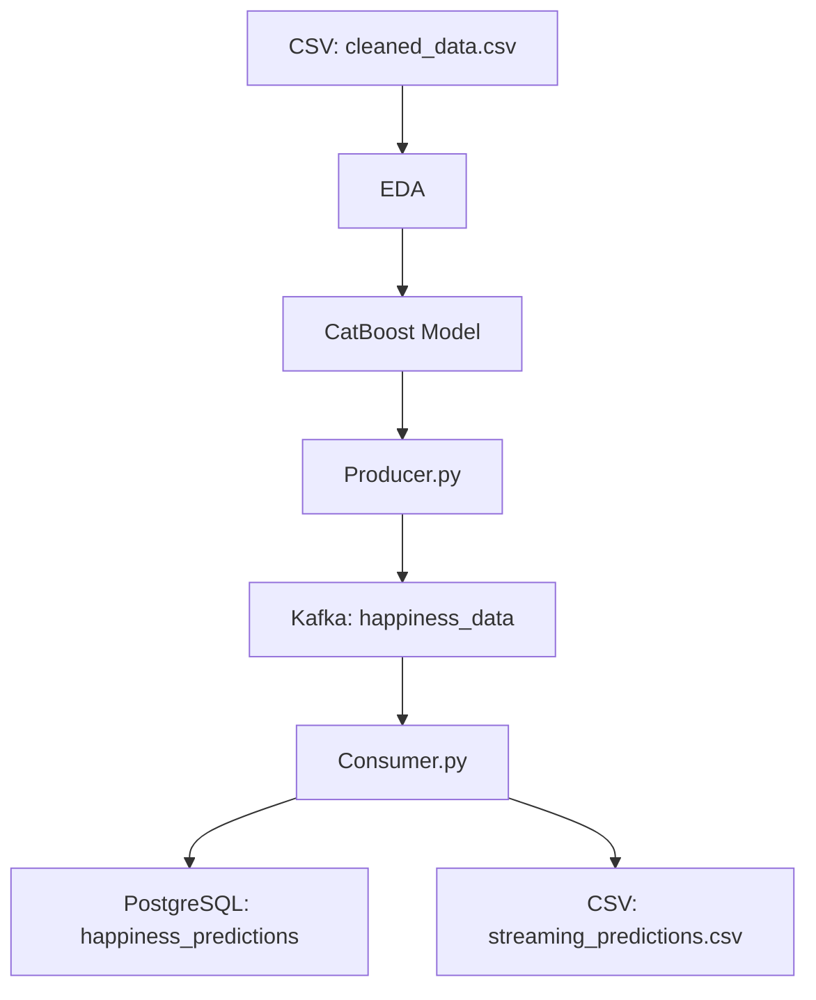

# ML-and-Data-Streaming

## Descripción

Este proyecto, desarrollado para el **Workshop 3: Machine Learning y Data Streaming**, implementa un pipeline de streaming para predecir el `Happiness_Score` del *World Happiness Report* (2015–2019) en tiempo real. Utiliza **Docker**, **Kafka**, **CatBoostRegressor** y **PostgreSQL** para procesar datos, realizar predicciones y almacenar resultados.

📈 El modelo logra un **R² de 85.5%** en entrenamiento y un excepcional **94.8% en streaming** *(RMSE: 0.2565)*.

---

## Características

- **EDA**: Limpieza y análisis del dataset `cleaned_data.csv` (~781 filas).
- **Modelo**: `CatBoostRegressor` con transformación **Box-Cox**.
- **Streaming**: Kafka para flujo de datos en tiempo real (~781 mensajes).
- **Almacenamiento**: Resultados almacenados en **PostgreSQL** (`happiness_predictions`) y en CSV (`streaming_predictions.csv`).
- **Métricas**:
  - Entrenamiento: R²: `0.8549`, RMSE: `0.4257`
  - Streaming: R²: `0.9483`, RMSE: `0.2565`

---

## Requisitos

- Docker y Docker Compose
- Python 3.8+
- Dependencias:
  - `pandas`, `numpy`, `kafka-python`, `catboost`, `sqlalchemy`, `psycopg2-binary`, `joblib`, `scikit-learn`
- PostgreSQL

---

## Instalación

### 1. Clona el repositorio

```bash
git clone https://github.com/memerazo/ML-and-Data-Streaming.git
cd ML-and-Data-Streaming
```

### 2. Crea un entorno virtual e instala las dependencias

```bash
python -m venv venv
source venv/bin/activate  # En Windows: venv\Scripts\activate
pip install -r requirements.txt
```

### 3. Configura PostgreSQL

- Crea una base de datos llamada `happiness_db`.
- Actualiza el archivo `config/credentials.json` con tus credenciales:

```json
{
  "user": "your_user",
  "password": "your_password",
  "host": "localhost",
  "port": "5432",
  "database": "happiness_db"
}
```

### 4. Asegúrate de tener el archivo `cleaned_data.csv` en el directorio raíz.

---

## Uso

### Inicia los servicios de Zookeeper y Kafka

```bash
docker-compose up -d
```

### Ejecuta el productor para enviar datos a Kafka

```bash
python scripts/producer.py
```

### Ejecuta el consumidor para procesar, predecir y almacenar

```bash
python scripts/consumer.py
```

### Verifica los resultados

- Revisa la tabla `happiness_predictions` en PostgreSQL.
- Archivos generados:
  - `streaming_predictions.csv`
  - `streaming_metrics_predictions.csv`
- Gráficos disponibles en `results/plots/`.

---

## Estructura del Repositorio

```
ML-and-Data-Streaming/
├── config/
│   └── credentials.json
├── data/
│   └── cleaned_data.csv
├── docs/
│   ├── streaming_pipeline_report.md
│   └── results_conclusions_report.md
├── notebooks/
│   └── streaming.ipynb
├── results/
│   └── plots/
├── scripts/
│   ├── producer.py
│   └── consumer.py
├── docker-compose.yml
├── requirements.txt
└── README.md
```

---

## Documentación

- **Pipeline**: [docs/streaming_pipeline_report.md](docs/streaming_pipeline_report.md)
- **Resultados y conclusiones**: [docs/results_conclusions_report.md](docs/results_conclusions_report.md)
- **Visualizaciones**: Análisis en `notebooks/streaming.ipynb` y gráficos en `results/plots/`.

---

## Notas

- Asegúrate de que Kafka (`localhost:9092`) y PostgreSQL (`localhost:5432`) estén activos.
- El modelo preentrenado `catboost_boxcox_bundle.pkl` debe estar en el directorio raíz.
- El pipeline maneja ~781 filas con un retardo simulado de **0.1s** por mensaje.

---

## Diagrama del Pipeline


